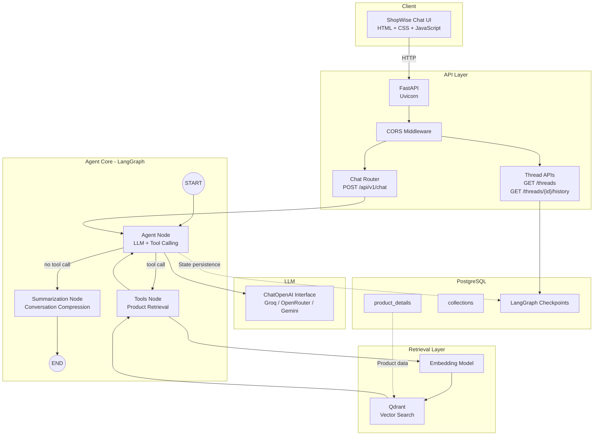
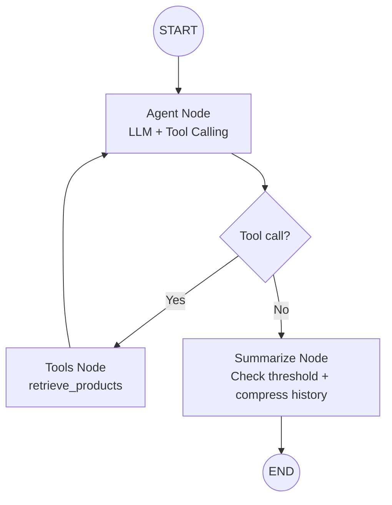
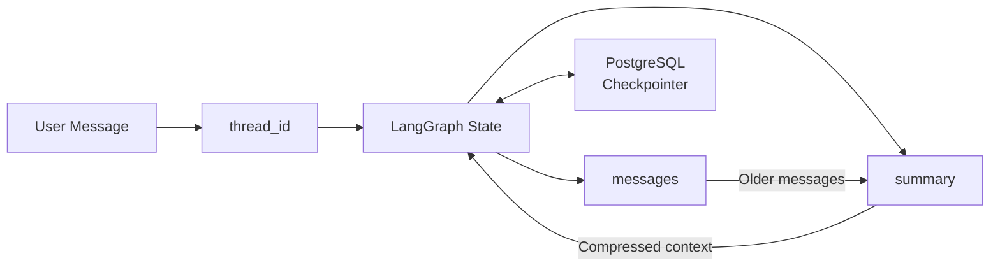
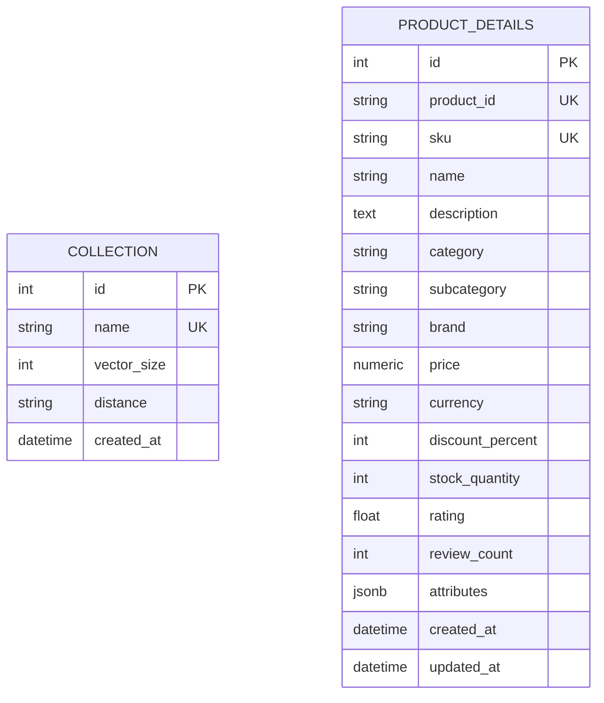
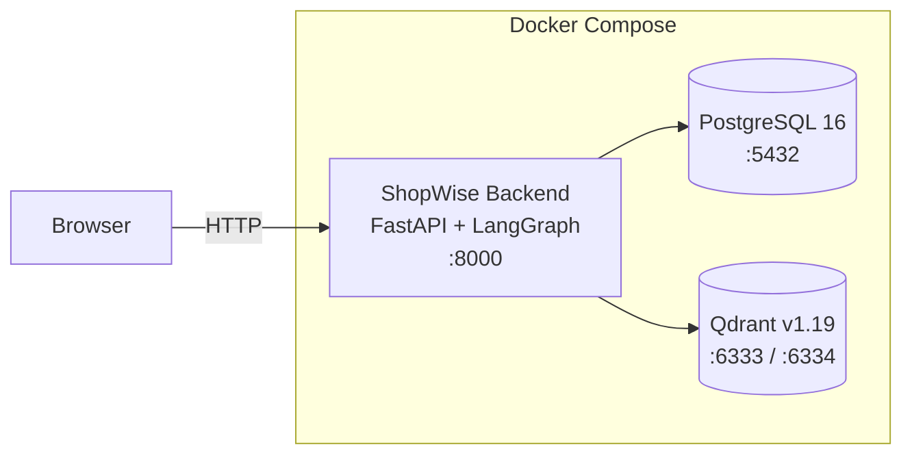

<div align="center">

# 🛍️ ShopWise Agent

**AI-powered product retrieval agent with conversational memory and streaming responses**

[](https://python.org)
[](https://fastapi.tiangolo.com)
[](https://langchain-ai.github.io/langgraph)
[](https://langchain.com)
[](https://qdrant.tech)
[](LICENSE)

</div>

---

## 📖 Overview

ShopWise Agent is a production-ready conversational AI assistant that helps customers discover products through **natural language queries**. It combines semantic vector search with a LangGraph-powered agent to deliver accurate, context-aware product recommendations.

### ✨ Key Features

| Feature | Description |
|---------|-------------|
| 🧠 **Summary-based Memory** | Conversations are progressively summarized when they exceed a threshold, preserving important context while keeping the LLM context window efficient |
| 🔍 **Semantic Product Retrieval** | Natural language queries are embedded and matched against a Qdrant vector store using cosine similarity |
| ⚡ **Real-time Streaming** | Token-by-token responses via Server-Sent Events (SSE) with thinking/tool-call indicators |
| 🎨 **Modern Chat UI** | Responsive Tailwind CSS frontend with sidebar, thread management, and typing animations |
| 📊 **Retrieval Evaluation** | Built-in metrics (Recall, Precision, Hit Rate, MRR @K) with LangSmith tracing for continuous improvement |
| 🔄 **Multi-provider LLM** | Switch between Groq, Gemini, or OpenRouter by changing a single `.env` variable |
| 💾 **Persistent Conversations** | All threads saved to PostgreSQL via LangGraph's PostgresSaver checkpoint |
| 🐳 **Docker Ready** | One-command deployment with Qdrant, PostgreSQL, and the backend service |

---

## 🏗️ System Architecture


## 🧠 Agent Workflow



## 🧠 Conversation Memory


## 🗄️ Database Schema


## 🐳 Docker Architecture


### Project Structure

```
shopwise-agent/
├── src/
│   ├── Agent/                          # Core agent logic
│   │   ├── agent.py                    # LLM orchestration (ask + stream functions)
│   │   ├── memory/
│   │   │   ├── graph.py                # LangGraph StateGraph builder
│   │   │   ├── state.py                # AgentState TypedDict (messages + summary)
│   │   │   ├── summarization.py        # System prompt, summary instruction, get_llm()
│   │   │   └── checkpoint.py           # PostgresSaver connection (lru-cached)
│   │   └── tools/
│   │       └── retrieval.py            # retrieve_products tool + search_products()
│   ├── api/
│   │   ├── routes/
│   │   │   ├── base.py                 # Root endpoint
│   │   │   ├── health.py               # Health check
│   │   │   └── chat.py                 # Chat, threads, history endpoints
│   │   └── schemas/
│   │       ├── base.py                 # StandardResponse, ErrorResponse
│   │       ├── health.py               # HealthStatus schema
│   │       └── chat.py                 # ChatRequest, ChatReply, ThreadSummary, etc.
│   ├── config/
│   │   └── settings.py                 # Pydantic settings (App, LLM, Qdrant, Postgres, etc.)
│   ├── db/
│   │   ├── models.py                   # SQLAlchemy ProductDetails model
│   │   └── session.py                  # Database session factory
│   ├── infrastructure/
│   │   ├── embeddings/                 # HuggingFace / Gemini embedding providers
│   │   └── vector_db/                  # Qdrant vector store provider
│   ├── frontend/
│   │   └── app.py                      # Streamlit alternative UI
│   └── main.py                         # FastAPI app, CORS, static files, routers
├── frontend/                           # Web chat UI
│   ├── index.html                      # Tailwind CSS + Material Design
│   ├── app.js                          # SSE streaming client, thread management
│   └── styles.css                      # Typing indicators, mobile drawer
├── eval/                               # Retrieval evaluation module
│   ├── metrics.py                      # Recall/Precision/HitRate/MRR@K computation
│   ├── tracing.py                      # LangSmith client + env setup
│   ├── run.py                          # CLI entrypoint (python -m eval.run)
│   ├── scripts/
│   │   └── generate_dataset.py         # Generates ground-truth queries from DB
│   └── data/
│       └── eval_queries.jsonl          # 36 ground-truth queries
├── tests/                              # Test suite
│   ├── test_memory_summary.py          # Memory summarization scenarios
│   ├── test_checkpointer.py            # Conversation persistence tests
│   └── test_retrieval.py               # Retrieval pipeline tests
├── docker-compose.yaml                 # Qdrant + PostgreSQL + Backend
├── Dockerfile                          # Python 3.12-slim container
├── pyproject.toml                      # Project config (pythonpath, test paths)
├── requirements.txt                    # Python dependencies
├── .env.example                        # Environment template
└── README.md
```

---

## 🚀 Quick Start

### Prerequisites

| Requirement | Version | Purpose |
|-------------|---------|---------|
| 🐍 Python | 3.12+ | Runtime |
| 🐘 PostgreSQL | 16+ | Conversation persistence |
| 🔎 Qdrant | 1.19+ | Vector database |
| 🔑 LLM API Key | — | At least one provider (Groq/Gemini/OpenRouter) |

### 1. Clone & Install

```bash
# Clone the repository
git clone https://github.com/your-username/shopwise-agent.git
cd shopwise-agent

# Create virtual environment
python -m venv .venv

# Activate (Windows)
.venv\Scripts\activate

# Activate (Linux/Mac)
# source .venv/bin/activate

# Install dependencies
pip install -r requirements.txt
```

### 2. Start Infrastructure

```bash
docker-compose up -d qdrant postgres
```

Verify services are running:

```bash
# Check Qdrant
curl http://localhost:6333/healthz

# Check PostgreSQL
pg_isready -h localhost -p 5432
```

| Service | Port | Dashboard | Purpose |
|---------|------|-----------|---------|
| 🔎 Qdrant | 6333 | http://localhost:6333/dashboard | Vector database for product embeddings |
| 🐘 PostgreSQL | 5432 | — | Conversation history & checkpointer |

### 3. Configure Environment

```bash
cp .env.example .env
```

**Minimal configuration** — just set your LLM provider:

```env
# Option A: Groq (fast, free tier available)
LLM_PROVIDER=groq
LLM_API_KEY=gsk_your_groq_key_here

# Option B: Gemini (Google AI)
# LLM_PROVIDER=gemini
# LLM_API_KEY=AIza_your_gemini_key_here

# Option C: OpenRouter (multi-model)
# LLM_PROVIDER=openrouter
# LLM_API_KEY=sk-or-your_openrouter_key_here
```

> 💡 **Tip:** Change only `LLM_PROVIDER` and `LLM_API_KEY` to switch providers. All other settings have sensible defaults.

### 4. Run the Server

```bash
uvicorn src.main:app --reload --host 0.0.0.0 --port 8000
```

Open **http://localhost:8000** in your browser 🎉

---

## ⚙️ Configuration

All settings are managed via `.env` file. Copy `.env.example` and edit.

**Switch LLM provider** (only 2 lines needed):

```env
LLM_PROVIDER=groq          # groq | gemini | openrouter
LLM_API_KEY=gsk_your_key   # your API key
```

**Key settings:**

| Category | Variables | Defaults |
|----------|-----------|----------|
| 🤖 LLM | `LLM_PROVIDER`, `LLM_API_KEY`, `LLM_MODEL` | `groq`, `openai/gpt-oss-120b` |
| 🧮 Embeddings | `EMBEDDING_PROVIDER`, `EMBEDDING_HUGGINGFACE_MODEL` | `huggingface`, `all-MiniLM-L6-v2` |
| 🔎 Vector DB | `QDRANT_URL`, `VECTOR_DB_COLLECTION` | `localhost:6333`, `ShopWiseProducts` |
| 🐘 PostgreSQL | `POSTGRES_HOST`, `POSTGRES_DB` | `localhost`, `shopwise` |
| 🧠 Memory | `AGENT_MEMORY_SUMMARY_THRESHOLD`, `AGENT_MEMORY_RECENT_MESSAGES` | `20`, `10` |
| 📊 Tracing | `LANGSMITH_TRACING`, `LANGSMITH_API_KEY` | `true` |

> Full list of all variables with descriptions in `.env.example`.

---

## 📡 API

| Method | Path | Description |
|--------|------|-------------|
| `GET` | `/` | Chat UI |
| `POST` | `/api/v1/chat` | Send message (SSE streaming) |
| `GET` | `/api/v1/threads` | List threads |
| `GET` | `/api/v1/threads/{id}/history` | Thread message history |
| `GET` | `/api/v1/health` | Health check |
| `GET` | `/docs` | Swagger UI |

**Chat request:**

```json
{"message": "shampoo for dry hair", "thread_id": null}
```

**SSE events:**

```
{"tool": "Searching products..."}   →  tool executing
{"thinking_done": true}              →  thinking complete
{"token": "I found 3 products"}     →  text token
{"done": true}                       →  stream finished
```

```bash
curl -N -X POST http://localhost:8000/api/v1/chat \
  -H "Content-Type: application/json" \
  -d '{"message": "shampoo for dry hair"}'
```

---

## 📊 Evaluation

```bash
python -m eval.run                      # run all 36 queries
python -m eval.run --k 5 --no-trace     # custom K, no tracing
python -m eval.scripts.generate_dataset # regenerate dataset
```

| K | Recall@K | Precision@K | Hit Rate@K | MRR@K |
|---|----------|-------------|------------|-------|
| 1 | 0.338 | 0.917 | 0.917 | 0.917 |
| 3 | 0.729 | 0.778 | 0.972 | 0.944 |
| 5 | 0.875 | 0.622 | 1.000 | 0.950 |

---

## 🧪 Testing

```bash
pytest              # run all tests
pytest -v           # verbose output
```

---

## 🐳 Docker

```bash
docker-compose up -d          # Start all services
docker-compose logs -f backend  # View logs
docker-compose down             # Stop all services
docker-compose down -v          # Stop and remove volumes
docker-compose up -d --build backend  # Rebuild after changes
```

| Service | Port | Description |
|---------|------|-------------|
| `qdrant` | 6333 | Vector database |
| `postgres` | 5432 | Conversation persistence |
| `backend` | 8000 | FastAPI application |

---

## 🛠️ Tech Stack

| Layer | Technology |
|-------|-----------|
| 🤖 Agent | LangGraph 1.2 + LangChain 1.3 |
| 🌐 API | FastAPI 0.141 + Uvicorn |
| 🧠 Memory | PostgresSaver (LangGraph) |
| 🔎 Vector DB | Qdrant 1.19 |
| 🧮 Embeddings | Sentence Transformers (`all-MiniLM-L6-v2`) |
| 💾 Database | PostgreSQL 16 |
| 🎨 Frontend | Tailwind CSS + Vanilla JS |
| 📊 Tracing | LangSmith |
| 📦 Deploy | Docker + Docker Compose |

---

## 📁 Data Flow

```
User Query → Embedding → Qdrant Search → LLM → SSE Stream → Frontend
                 ↑                              ↑
           HuggingFace              Product data + Summary
```

```
Memory: [m1..m20, m21, m22]  →  threshold=20
         ↓                        ↓
    Summarize [m1..m20]      Keep [m21, m22]
         ↓
    summary + recent messages
```

---

